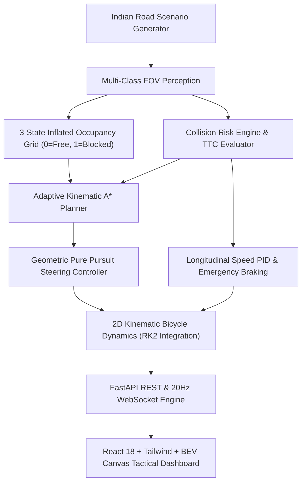

# Open-Source Software Architecture (SIH26037)

## System Architecture

## Mathematical & Algorithmic Formulations

### 1. Pure Pursuit Steering
The front wheel steering angle $\delta$ is computed from the local lateral error $y_r$ to lookahead distance $L_d(v)$:
$$\delta = \arctan\left(\frac{2 L y_r}{L_d^2}\right)$$
where $L_d(v) = \max(2.5, \min(7.0, k_{ld} \cdot v))$ and $L = 2.7\text{m}$.

### 2. Time-To-Collision (TTC) & 3-Tier Risk
$$\text{TTC} = \frac{d - (r_{\text{obs}} + L/2)}{v_{\text{closing}}}$$
- **CRITICAL**: $\text{TTC} \le 1.8\text{s}$ or $d \le 3.5\text{m}$ $\implies$ Full emergency braking ($a = -6.0\text{m/s}^2$) and immediate lateral replan.
- **WARNING**: $\text{TTC} \le 3.5\text{s}$ or $d \le 8.0\text{m}$ $\implies$ Cautious speed reduction ($v \le 3.5\text{m/s}$).
- **SAFE**: Road clear $\implies$ Cruise at nominal target speed ($7.0\text{m/s}$).

### 3. Kinematic Bicycle Model (RK2 Midpoint Integration)
$$\dot{x} = v \cos\theta, \quad \dot{y} = v \sin\theta, \quad \dot{\theta} = \frac{v}{L}\tan\delta, \quad \dot{v} = a$$
Solved at each step $\Delta t = 0.05\text{s}$ ($20\text{Hz}$) using 2nd-order Runge-Kutta numerical integration.
